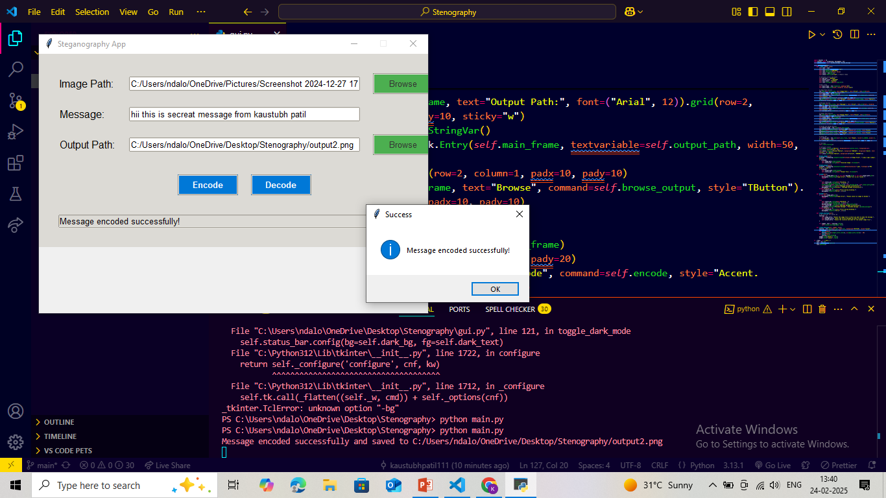
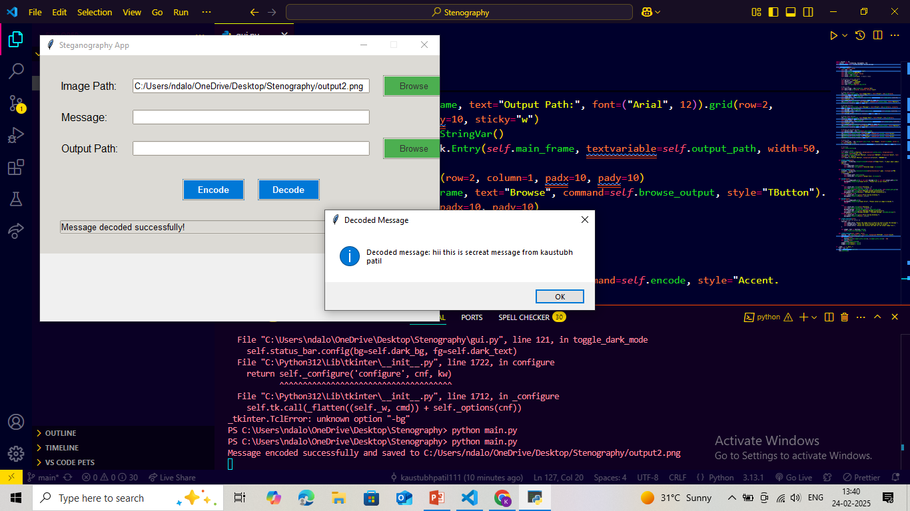

# Steganography Project

This project allows you to encode secret messages into images and decode them using Least Significant Bit (LSB) steganography. The project includes a Python script with a Graphical User Interface (GUI) built using Tkinter.

## Table of Contents
- [Features](#features)
- [Installation](#installation)
- [Usage](#usage)
- [Project Structure](#project-structure)
- [How It Works](#how-it-works)
- [Contributing](#contributing)
- [License](#license)
- [Screenshots](#screenshots)
- [Acknowledgments](#acknowledgments)

## Features
- **Encode Messages:** Hide a secret message inside an image.
- **Decode Messages:** Extract a hidden message from an encoded image.
- **User-Friendly GUI:** Built with Tkinter for easy interaction.
- **Error Handling:** Provides meaningful error messages for invalid inputs.
- **Cross-Platform:** Works on Windows, macOS, and Linux.

## Installation

### Prerequisites
- Python 3.6 or higher
- Pillow library (for image processing)

### Steps
Clone the repository:

```bash
git clone https://github.com/your-username/steganography-project.git
cd steganography-project
```

Install the required dependencies:

```bash
pip install -r requirements.txt
```

## Usage

### Running the Application
Navigate to the project directory:

```bash
cd steganography-project
```

Run the `main.py` file:

```bash
python main.py
```

### The GUI will open. Follow these steps:

#### Encode a Message:
1. Select an image file.
2. Enter the secret message.
3. Choose the output path for the encoded image.
4. Click **Encode**.

#### Decode a Message:
1. Select an encoded image file.
2. Click **Decode** to extract the hidden message.

## Project Structure

```
steganography-project/
│
├── main.py                # Entry point for the application
├── gui.py                 # GUI implementation using Tkinter
├── steganography.py       # Core logic for encoding and decoding messages
├── requirements.txt       # List of dependencies
└── README.md              # Project documentation
```

## How It Works

### Encoding
1. The message is converted into a binary string.
2. The binary string is embedded into the least significant bits (LSBs) of the image's pixel values.
3. A delimiter (`1111111111111110`) is added to mark the end of the message.
4. The modified image is saved as a new file.

### Decoding
1. The LSBs of the image's pixel values are extracted.
2. The binary string is converted back into the original message.
3. The process stops when the delimiter is encountered.

## Contributing
Contributions are welcome! If you'd like to contribute, please follow these steps:

1. Fork the repository.
2. Create a new branch for your feature or bugfix.
3. Commit your changes.
4. Submit a pull request.

## License
This project is licensed under the MIT License. See the `LICENSE` file for details.

## Screenshots
### Encode Message


### Decode Message


## Acknowledgments
- [Pillow](https://python-pillow.org/) for image processing.
- [Tkinter](https://docs.python.org/3/library/tkinter.html) for the GUI.
